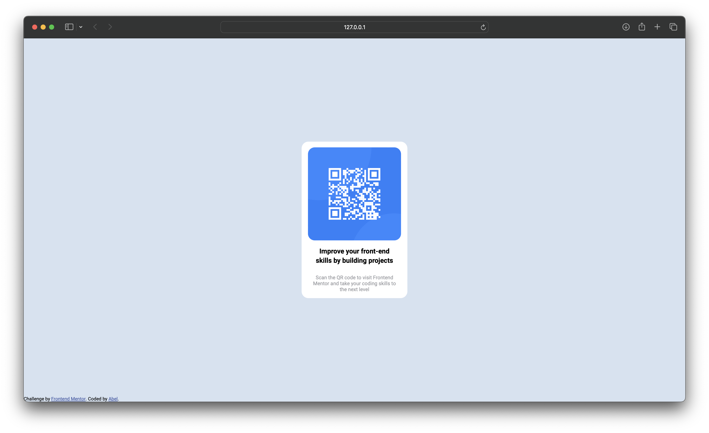

# Frontend Mentor - QR code component solution

This is a solution to the [QR code component challenge on Frontend Mentor](https://www.frontendmentor.io/challenges/qr-code-component-iux_sIO_H). Frontend Mentor challenges help you improve your coding skills by building realistic projects.

## Table of contents

- [Overview](#overview)
  - [Screenshot](#screenshot)
  - [Links](#links)
- [My process](#my-process)
  - [Built with](#built-with)
  - [What I learned](#what-i-learned)
  - [Useful resources](#useful-resources)
- [Author](#author)

## Overview

### Screenshot

### Links

- Live Site URL: 

## My process

### Built with

- CSS custom properties i.e., absolute positioning

### What I learned

I learned about absolute positioning in CSS through the process of creating a QR code component. While working on this component, I needed to precisely position the QR code image within a container div. Absolute positioning allowed me to precisely control the placement of the QR code, ensuring it was centered and aligned exactly where I wanted it on the page.

### Useful resources

- [SuperSimpleDev](https://www.youtube.com/watch?v=G3e-cpL7ofc&t=17188s) - This channel helped me understand a lot of the basics behind CSS.

## Author

- Frontend Mentor - [@abelparayil](https://www.frontendmentor.io/profile/abelparayil)
- LinkedIn - [abelparayil](https://www.linkedin.com/in/abelparayil/)
- Twitter - [@abelparayil](https://twitter.com/abelparayil)
